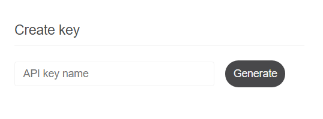
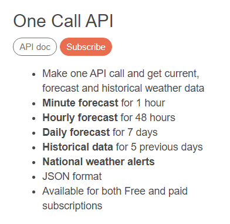
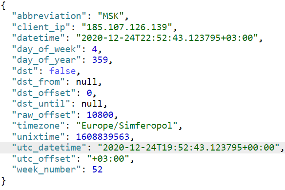
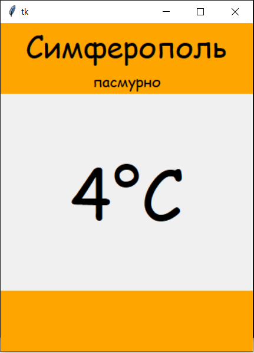
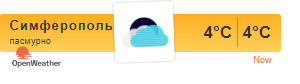

<p align="center">МИНИСТЕРСТВО НАУКИ  И ВЫСШЕГО ОБРАЗОВАНИЯ РОССИЙСКОЙ ФЕДЕРАЦИИ<br>
Федеральное государственное автономное образовательное учреждение высшего образования<br>
"КРЫМСКИЙ ФЕДЕРАЛЬНЫЙ УНИВЕРСИТЕТ им. В. И. ВЕРНАДСКОГО"<br>
ФИЗИКО-ТЕХНИЧЕСКИЙ ИНСТИТУТ<br>
Кафедра компьютерной инженерии и моделирования</p>
<br>
<h3 align="center">Отчёт по лабораторной работе № 1<br> по дисциплине "Программирование"</h3>
<br><br>
<p>студента 1 курса группы ПИ-б-о-202(1)<br>
Светлов Кирилл Анатольевич<br>
направления подготовки 09.03.04 "Программная инженерия"</p>
<br><br>
<table>
<tr><td>Научный руководитель<br> старший преподаватель кафедры<br> компьютерной инженерии и моделирования</td>
<td>(оценка)</td>
<td>Чабанов В.В.</td>
</tr>
</table>
<br><br>
<p align="center">Симферополь, 2020</p>
<hr>

# Лабораторная работа №1 Погода
**Цель работы:**
1.  Закрепить навыки разработки многофайловыx приложений;
2.  Изучить способы работы с API web-сервиса;
3.  Изучить процесс сериализации/десериализации данных в/из json;
4.  Получить базовое представление о сетевом взаимодействии приложений;

<h2>Постановка задачи</h2>
Разработать сервис предоставляющий данные о погоде в городе Симферополе на момент запроса. В качестве источника данных о погоде используется: http://openweathermap.org/. В состав сервиса входит: серверное приложение на языке С++ и клиентское приложение на языке Python.

Серверное приложение (далее Сервер) предназначенное для обслуживания клиентских приложений и минимизации количества запросов к сервису _openweathermap.org_. Сервер должен обеспечивать возможность получения данных в формате JSON и виде _html_ виджета (для вставки виджета на страницу будет использоваться _[iframe](https://habr.com/ru/post/488516/)_).

Клиентское приложение должно иметь графический интерфейс отображающий сведения о погоде и возможность обновления данных по требованию пользователя.

<h2>Выполнение работы</h2>
<h3>1. Получение API Key</h3>
Для получения API Key я зарегистрировался на сайте http://openweathermap.org/. После регистрации в разделе API Keys сгенерировал новый API-ключ при помощи генератора "Create key" (рис. 1). В итоге получен API-ключ: 01daea410dddfb7139d43e08499eecd4



Рис. 1 - Генератот API-ключей

<h3>2. Составление запроса для подключения погоды</h3>
В ходе лабораторной работы был изучен формат составления запросов к сервису openweather.org. Были изучены способы использования API. Согласно заданию был выбран одноразовый вызов api "One Call API" (рис. 2).



Рис. 2 - One Call API и его описание

Далее, согласно заданию, был составлен запрос на получение прогноза погоды для Симферополя с почасовым интервалом, в градусах Цельсия, на русском языке. Для этого в запрос были введены такие параметры, как:
1.  широта и долгота г. Симферополь (lat=44.952116 и lon=34.102411);
2.  исключение всей информации о погоде кроме почасовой (exclude=current,minutely,daily,alerts);
3.  измерительная система в градусах Цельсия (units=metric);
4.  русский язык (lang=ru);

В конечном итоге был получен http-запрос: http://api.openweathermap.org/data/2.5/onecall?lang=ru&units=metric&exclude=current,minutely,daily,alerts&lat=44.952116&lon=34.102411&appid=01daea410dddfb7139d43e08499eecd4

<h3>3. Составление запроса для получения времени</h3>
Для того чтобы получить время в Симферополе, я воспользовался сервисом http://worldtimeapi.org/pages/schema. Изучив на данном сайте примеры использования API, я получил запрос (рис. 3):
http://worldtimeapi.org/api/timezone/Europe/Simferopol



Рис. 3 - Ответ, полученный от worldtimeapi

<h3>4. Создание серверного приложения</h3>
Для создания серверного приложения был использован язык C++. Дополнительно были подключены библиотеки httplib (для работы с HTTP-клиентом и HTTP-сервером) и nlohmann (для работы с файлами формата JSON). Если запрос приходит на "/", сервер формирует и отправляет html-виджет, если же запрос приходит на "/raw", сервер формирует и отправляет json-файл с данными о текущей температуре и состоянии погоды.

```c++

#include <iostream>
#include <fstream>
#include <iomanip>
#include <cpp_httplib/httplib.h>
#include <nlohmann/json.hpp>

using namespace httplib;
using namespace std;

using nlohmann::json;

string weather_js;

string get_info(const char* host, const char* api) {
    Client cli(host);
    auto res = cli.Get(api);
    if (res) {
        if (res->status == 200) {
            cout << res->body << endl;
            return res->body;
        }
        else {
            cout << "Status code: " << res->status << endl;
        }
    }
    else {
        auto err = res.error();
        cout << "Error code: " << err << endl;
    }
}

int get_untime() {
    string untime;
    untime = get_info("http://worldtimeapi.org", "/api/timezone/Europe/Simferopol");
    if (untime != "") {
        json j = json::parse(untime);
        return j["unixtime"];
    }
    return 0;
}

string get_weather_data() {
    string weather_data;
    weather_data = get_info("http://api.openweathermap.org", "/data/2.5/onecall?lang=ru&units=metric&exclude=current,minutely,daily,alerts&lat=44.952116&lon=34.102411&appid=01daea410dddfb7139d43e08499eecd4");
    return weather_data;
}

int get_weather_id(int untime) {
    if (weather_js != "") {
        json j = json::parse(weather_js);
        for (int i = 0; i < j["hourly"].size(); i++) {
            if (j["hourly"][i]["dt"] > untime) {
                return i;
            }
        }
    }
    return -1;
}

int refresh_id() {
    int untime = get_untime();
    int id = get_weather_id(untime);
    if (id < 0) {
        weather_js = get_weather_data();
        id = get_weather_id(untime);
    }
    return id;
}

double get_temp(int id) {
    json j = json::parse(weather_js);
    return j["hourly"][id]["temp"];
}

string get_description(int id) {
    json j = json::parse(weather_js);
    return j["hourly"][id]["weather"][0]["description"];
}

string get_icon(int id) {
    json j = json::parse(weather_js);
    return j["hourly"][id]["weather"][0]["icon"];
}

bool get_weather_data(double& temp, string& description, string& icon) {
    try {
        int id = refresh_id();

        if (weather_js != "") {

            temp = get_temp(id);
            description = get_description(id);
            icon = get_icon(id);
        }

    }
    catch (...) {
        return false;
    }
    return true;
}

string replacement(string str, string origin, string new_info) {
    SIZE_T strbegin = str.find(origin);
    return str.replace(strbegin, origin.length(), new_info);
}

string create_widget(int temp, string description, string icon) {
    ifstream file("widget_template.html");
    string str;
    getline(file, str, '\0');

    str = replacement(str, "{hourly[i].temp}", std::to_string(temp));
    str = replacement(str, "{hourly[i].temp}", std::to_string(temp));
    str = replacement(str, "{hourly[i].weather[0].description}", description);
    str = replacement(str, "{hourly[i].weather[0].icon}", icon);

    return str;

    file.close();
}


string create_raw(int temp, string description) {
    std::stringstream ss;
    json j;
    j["temp"] = temp;
    j["description"] = description;
    ss << std::setw(2) << j << std::endl;
    return ss.str();
}

void main_response(const Request& req, Response& res) {
    double temp = 0;
    string description = "", icon = "";
    if (get_weather_data(temp, description, icon)) 
        res.set_content(create_widget(round(temp), description, icon), "text/html; charset=UTF-8");
    else
        res.set_content("Service is unavailable", "text/html");
}

void raw_response(const Request& req, Response& res) {
    double temp = 0;
    string description = "", icon = "";
    if (get_weather_data(temp, description, icon))
        res.set_content(create_raw(round(temp), description), "text/plain; charset=UTF-8");
    else
        res.set_content("Service is unavailable", "text/html");
}

int main()
{
    setlocale(LC_ALL, "rus");
    Server svr;
    std::cout << "Start server... OK\n";
    svr.Get("/", main_response);
    svr.Get("/raw", raw_response);
    svr.listen("localhost", 3000);
}
```

<h3>5. Создание клиентского приложения</h3>
Для создания клиентского приложения был использован язык к Python. Дополнительно были использованы библиотеки requests (для работы с сетью) и json (для работы с файлами формата JSON). Приложение обращается к серверу по протоколу "/raw" и получает от него данные о текущей температуре и состоянии погоды для города Симферополь в формате JSON.

```python

from tkinter import *
import requests
import json

root = Tk()

frame1 = Frame(root)
label_city = Label(frame1, height=1, width=6, font=("Comic Sans MS", 30), text='Симферополь', bg='orange', fg='black')
label_weather = Label(frame1, height=1, width=6, font=("Comic Sans MS", 15), text='', bg='orange', fg="black")
frame2 = Frame(root)
label_temp = Label(frame1, height=2, width=6, font=("Comic Sans MS", 70), text='-')
frame3 = Frame(root)
Empty = Label(frame3, height=2, width=6, font=("Comic Sans MS", 20), bg='orange')

Empty.pack(expand=YES, fill=BOTH)
label_city.pack(expand=YES, fill=BOTH)
label_weather.pack(expand=YES, fill=BOTH)
label_temp.pack(expand=YES, fill=BOTH)
frame1.pack(expand=YES, fill=BOTH)
frame2.pack(expand=YES, fill=BOTH)
frame3.pack(expand=YES, fill=BOTH)

def refresh(event):
	global label_city
	global label_weather
	global label_temp
	r = requests.get('http://localhost:3000/raw')
	j = json.loads(r.text)
	label_weather.config(text = j["description"]) 
	label_temp.config(text = str(j["temp"])+'°C')

root.bind('<Button-3>', refresh)

root.mainloop()

```

<h3>6. Графический интерфейс</h3>
Графический интерфейс (рис. 4) создавался при помощи библиотеки tkinter.



<h3>6. Графический интерфейс</h3>
При подключении к протоколу "/" на сервере, программа изменяет локальный файл "widget.html" и редактирует поля с данными о погоде (температура, состояние погоды, иконка), затем возвращает браузеру виджет в виде html-документа (рис. 5).



<h3>Вывод</h3>
В ходе лабораторной работы были получены навыки разработки многофайловыx приложений. Также были изучены способы работы с API web-сервисов openweathermap и worldtime. Были изучены процессы сериализации и десериализации данных в и из json, а также получены базовое представление о сетевом взаимодействии приложений.
