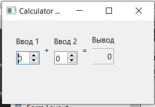

МИНИСТЕРСТВО НАУКИ  И ВЫСШЕГО ОБРАЗОВАНИЯ РОССИЙСКОЙ ФЕДЕРАЦИИ 
Федеральное государственное автономное образовательное учреждение высшего образования 
"КРЫМСКИЙ ФЕДЕРАЛЬНЫЙ УНИВЕРСИТЕТ им. В. И. ВЕРНАДСКОГО" 
ФИЗИКО-ТЕХНИЧЕСКИЙ ИНСТИТУТ 
Кафедра компьютерной инженерии и моделирования

 
<h3 align="center">Отчёт по лабораторной работе № 4  по дисциплине "Программирование"</h3>
  

студента 1 курса группы ПИ-б-о-202(1) 
Светлов Кирилл Анатольевич 
направления подготовки 09.03.04 "Программная инженерия"

  
<table>
<tr><td>Научный руководитель  старший преподаватель кафедры  компьютерной инженерии и моделирования</td>
<td>(оценка)</td>
<td>Чабанов В.В.</td>
</tr>
</table>
  

Симферополь, 2021

# Лабораторная работа №4 Знакомство с фреймворком Qt
**Цель работы:**
1. Установить фреймворк Qt;
2. Изучить основные возможности создания и отладки программ в IDE Qt Creator.

<h2>Постановка задачи</h2>
Настроить рабочее окружение, для разработки программного обеспечения при помощи Qt и IDE Qt Creator, а также изучить базовые возможности данного фреймворка.

<h2>Выполнение работы</h2>
<h3>Задание 1</h3>
Я скачал с официального сайта и установил последнюю версию фреймворка Qt (в моём случае 6.0.2).
В процессе установки я выбрал компоненты Qt для сборки при помощи MinGW и подходящую к этим компонентам версию MinGW (в моём случае 8.1.0).
Для того, чтобы убедиться, что установка прошла успешно, я язапустил среду разработки Qt Creator и в разделе Примеры нашёл проект Calculator Form Example.
После нажатия по проекту выбрал версию под Desktop и щёлкнул по кнопке Редактор.
На боковой панели в разделе Проекты в каталоге Формы открыл главную форму проекта и заменил текст "Input 1", "Input 2", "Output" на "Ввод 1", "Ввод 2" и "Вывод" соответственно (рис. 1). Для этого я щёлкнул по нужному компоненту на форме и в окне Редактор свойств поменял значение свойства text.

Рис. 1 - Изменённое окно приложения.

<h3>Задание 2</h3>
1. Как изменить цветовую схему (оформление) среды?
2. Как закомментировать/раскомментировать блок кода средствами Qt Creator? Имеется ввиду комбинация клавиш или пункт меню.
3. Как открыть в проводнике Windows папку с проектом средствами Qt Creator?
4. Какое расширение файла-проекта используется Qt Creator? Может быть несколько ответов.
5. Как запустить код без отладки?
6. Как запустить код в режиме отладки?
7. Как установить/убрать точку останова (breakpoint)?

1. "Инструменты" -> "Параметры" -> "Среда";
2. "Ctrl + /" или "Правка" -> "Дополнительно" -> "Закомментировать/раскомментировать";
3. В окне "Проекты" выбираем необходимый файл проекта и нажав правой кнопкой мыши выбираем пункт "Показать в проводнике";
4. .pro, .qmake;
5. Нажать на зелёный треугольник в левом нижнем углу;
6. Нажать на зелёный треугольник с жуком в левом нижнем углу;
7. Нажать левой кнопкой мыши слева от номера строки.

<h3>Задание 3</h3>
6 строка:
i = 0
d = 3.8238547e-317
7 строка:
i = 5
d = 1.006874e-317
8 строка:
i = 5
d = 5

<h3>Вывод</h3>
В ходе лабораторной работы был установлен фреймворк Qt, а также были изучены основные возможности создания и отладки программ в IDE Qt Creator.
